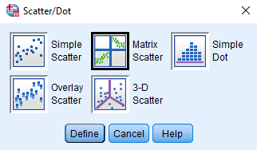

Aim
================================================================================

The regression techniques we have focused on thus far describe how one variable can be used to predict variation in another. The natural world rarely provides such simple relationships, and typically more than one variable is required to explain fully the variation observed (e.g. soil infiltration rates depend on rainfall intensity AND soil moisture content, along with other factors).  Multiple regression can be used to differentiate between the effects of variables and to ascertain which factors are most important.


Notation
--------------------------------------------------------------------------------

Multiple regression models the change in the dependent variable y when more than one independent variable has a significant influence. Recall how we predict the independent variable y from the dependent variable x using a simple linear regression,

$$y = a + bx.$$

In the simple linear regression above, we predict y from the intercept (a), and a single independent variable (x) and slope (b). How a unit change in x (e.g., one mm, one kg, or whatever unit we are measuring x in) corresponds to a change of b units in y.

In multiple regression, as the name implies, we can predict y from the intercept (a) and multiple independent variables ($x_1$, $x_2$, etc.) each fitted its own coefficient ($b_1$, $b_2$, etc.). Multiple regression coefficients describe the effects of each of these independent variables on the depend variable, while holding the rest of the independent variables constant [i.e., $b_1$ tells us how much change their is in y given a change in $x_1$, assuming that $x_2$ remains fixed; @Morrissey2018].

The equation for multiple regression using two independent variables would be,

$$y = a + b_{1}x_{1} +b_{2}x_{2}.$$

We can extend this even further to any number of k independent variables,

$$y = a + b_{1}x_{1} +b_{2}x_{2} +  ... + b_{k}x_{k}.$$
Note that this is really just an extension of the simple linear regression model that we discussed in the previous lecture, and we can talk about the statistical and practical validity of a regression model as before. 

Adjusted coefficient of determination
--------------------------------------------------------------------------------

With the addition of new independent variables, the proportion of the variance in y explained by our model is expected to increase even if the new independent variables are not very good predictors. This is because the amount of variation explained by our model can only increase if we add new independent variables (i.e., a new independent variable cannot explain a *negative* amount of variation; that does not make any sense, so the worst it could do is explain zero variation, and it likely explain some of the variation just by chance). Hence, even if those independent variables are random numbers, they might still improve the goodness of fit of our model by chance. To help account for this spurious improvement of fit, we can use an adjusted R squared,

$$R^{2}_{adj} = 1 - \left(1 - R^{2}\right)\left(\frac{n - 1}{n - k - 1}\right).$$

It is not critical that you memorise the above equation, but it is important to understand its relevance when you see it being used in statistical software such as SPSS. In the above equation, the $R^{2}$ is the familiar coefficient of determination from Lecture 11, k is the number of independent variables in the model. Note that as k increases, the fraction above (n-1)/(n-k-1) gets bigger. You can try this for yourself by plugging in some values for n and k (e.g., n = 100 and k = 0, 1, 2, 3, 4). As this fraction gets bigger, we are subtracting a bigger value from 1, so our adjusted R-squared value must decrease. This matches the key concept; more parameters (k) cause a decrease in the adjusted R-squared value.

Choosing a model
--------------------------------------------------------------------------------

With multiple regression, we now have the decision of which independent variables (i.e., our x variables) to include or not include in our final model to predict our dependent variable (y). In general, we want to include independent variables that have an explanatory role in predicting our dependent variable, and we want to exclude independent variables that have no explanatory role and therefore do not improve prediction. Because each independent variable that we add to the model can only increase the total variation explained in our dependent variable (for reasons explained in the section above), there is a danger that we might be including independent variables that are actually not relevant to prediction. 

Here is an example. Suppose that we start out with a simple linear regression (one independent variable). The equation below predicts y from a single x variable ($x_{1}$) and a regression coefficient ($b_1$),

$$y = a + b_{1}x_{1}.$$

We might run a linear regression and find that the above model explains 43 per cent of the total variation in y (i.e., $R^{2} = 0.43$). We might decide to add a second independent variable to the model ($x_{2}$) with its own regression coefficient ($b_2$),

$$y = a + b_{1}x_{1} + b_{2}x_{2}.$$

Now we have two independent variables to predict y. We could run a multiple regression analysis, and perhaps we find that with the addition of the new variable, our updated model now explains 64 per cent of the total variation in y. This seems like a substantial increase in our ability to predict y, and we might reasonably conclude that the additional independent variable is an improvement. But suppose we add one more independent variable to the model,

$$y = a + b_{1}x_{1} + b_{2}x_{2} + b_{3}x_{3}.$$

Now let us say that our newly updated model explains 64.2 per cent of the total variation in y. That is, adding our third independent variable only explains 0.2 per cent more of the variation in y than our model with the first two independent variables. In this case, we might reasonably conclude that this last variable has not really improved our model, and that we would prefer the simpler one instead.

How do we decide on the best model? There is no easy answer to this question, and opinions vary both on what is actually meant by 'best' model and the proper way to obtain it. In general, most researchers would probably agree that the inclusion of independent variables should be based on good scientific principles; in other words, we should have a reason for including x variables that is based on a good scientific understanding of the question. In general, most researchers would also acknowledge that model selection should try to achieve a balance between model simplicity (i.e., fewer independent variables) and model explanatory power (i.e., better fit). There are many ways to do this, and we could easily spend several weeks investigating different approaches if we had the time. Instead, we will focus on only one approach to balancing model complexity with explanatory power, called **stepwise regression**.


Stepwise regression
--------------------------------------------------------------------------------

Stepwise regression works by starting with a null model (i.e., a model no independent variables and our dependent variable y is predicted by the mean of y). For each 'step' of the procedure, we then do the following:

1. Check to see if adding any of the independent variables would significantly improve the amount of variation explained by the model (i.e., would significantly increase the R-squared).
2. If one or more independent variables would improve the model fit, then add the independent variable that would improve the fit the most to the model.
3. Check to see if the addition of the new independent variable causes any existing independent variable to exceed a threshold p-value (p > 0.10 by default in SPSS).
4. Stop when there are no more variables to include or remove.

It is not important that you remember the exact details here. What is important is that you understand the objective of the stepwise rejection and what it is doing. Our objective is to try to balance model simplicity (minimising independent variables included) and explanatory power (improved fit). With stepwise regression, we are doing this by starting with a null model and adding new independent variables until they no longer sufficiently improve model fit.

This is a forward stepwise selection method, and the one that we will use in SPSS. We could have also used a backwards stepwise selection procedure (i.e., starting with a model that includes all of the available independent variables and removing them one by one), or some other type of model selection entirely such as Akaike information criterion (AIC) or Bayesian information criterion (BIC). It is not important that you know these different types of model selection, but it is important to recognise that the forward stepwise selection described above is just one method among many.


Multiple regression in SPSS
--------------------------------------------------------------------------------

Here we consider an example of multiple regression in SPSS. In 1993, monthly amounts of nitrate (as tonnes of nitrogen) were measured in the River Thames, together with mean daily evaporation and rainfall (in mm) for 12 months of the year. We wish to examine if evaporation and rainfall can be used to predict nitrate amounts in the river.


```{r, echo = FALSE}
library(knitr);
nitrogen    <- c(22, 26, 27, 18, 12, 9, 7, 6, 7, 8, 12, 21);
evaporation <- c(0.3, 0.4, 0.9, 1.9, 2.7, 3.3, 3.4, 3.4, 2.3, 1.2, 0.5, 0.3);
rainfall    <- c(2.1, 1.5, 2.0, 1.5, 1.7, 1.9, 1.5, 1.4, 1.7, 1.9, 2.4, 2.2);
thames      <- data.frame(nitrogen, evaporation, rainfall);
rownames(thames) <- c("Jan", "Feb", "Mar", "Apr", "May", "Jun", "Jul", "Aug",
                      "Sep", "Oct", "Nov", "Dec");
colnames(thames) <- c("Nitrogen_(tonnes)", "Evaporation_(mm)", "Rainfall_(mm)");
write.csv(x = thames, file = "thames.csv");
kable(thames);
```

To start, we need to visualise the data set. We could make scatterplots for all of the possible combinations of variables (i.e., nitrogen versus evaporation, nitrogen versus rainfall, and evaporation versus rainfall), but this can be time-consuming, and it does not allow us to see everything at once. In SPSS, we can use a multiple scatterplot by selecting 'Graphs > Legacy dialogs > Scatter/Dot' from the toolbar. We will see a box that looks like the one below.



We can click on the box called 'Matrix Scatter', then click 'Define'. When the next box appears, we can add our variables nitrogen, evaporation, and rainfall variables to the box 'Matrix Variables', then click 'OK'. A matrix scatter plot will appear in the SPSS output, which will look something like the below.


We can interpret each panel of the figure above as its own scatterplot between two variables of interest. For example, the scatterplot in the upper right shows the relationship between rainfall (x axis) and nitrogen (y axis). Note that this figure is also symmetric; the lower left panel shows the same relationship in reverse, with nitrogen on the x axis and rainfall on the y axis (see how the scatterplot has the same shape, but with the points flipped). Also notice that there are no points in the diagonal of this matrix of scatter plots. These panels would be comparing a variable against itself, thereby producing a perfect linear relationship, so there is really no point in plotting these (the figure below shows an example of what a scatter plot of what it would look like to have nitrogen on both the x and y axes).

```{r, echo = FALSE}
plot(x = nitrogen, y = nitrogen, xlab = "Nitrogen_tonnes", cex = 2,
     ylab = "Nitrogen_tonnes", cex.lab = 1.25, cex.axis = 1.25, pch = 20);
#png(file = "img/nitrogen-nitrogen.png");
#plot(x = nitrogen, y = nitrogen, xlab = "Nitrogen_tonnes", cex = 2,
#     ylab = "Nitrogen_tonnes", cex.lab = 1.25, cex.axis = 1.25, pch = 20);
#dev.off();
```

The above is obviously not very informative, so it is not included (in some programs, the empty diagonal is replaced by a histogram of the variable).

Going back to the matrix scatterplot, we can look at the three panels in the top right corner where our dependent variable (Nitrogen) is plotted on the y axis against evaporation and rainfall on the x axis. A careful inspection of the scatterplots suggests that there is a negative linear relationship between nitrogen in the river and evaporation, but there is no obvious relationship betwen nitrogen and rainfall. Next, we will use multiple regression to more formally determine the best model for predicting nitrogen in the river.

Before proceding with our multiple regression, we should check the assumptions of our model. As we did with simple linear regression, we can check the assumption that our dependent variable is normally distributed. We could do this with a test of normality (e.g., a Shapiro-Wilks test), but let us use a Q-Q (i.e., 'Quantile-Quantile') plot this time. A Q-Q plot is a general graphical method for comparing two distributions, and it is perhaps most commonly used to compare a set of observed values from what we would predict those values to be given a normal distribution [@Sokal1995].

To do this, we need to go to 'Analyse > Descriptive Statistics > Explore', putting 'Nitrogen_tonnes' in the Dependent List, and then using the 'Plots' option to check 'Normality plots with tests'. Here is the Q-Q plot produced by SPSS.


What are we looking at? Let us start with the x-values ('Observed Value'). These are simply our y values (nitrogen) plotted on the x axis (note that our minimum value is 6 and our max is 27). The y axis is a bit more challenging to understand. These show the values that we would expect our data points to be given their rank order in a normally distributed data set of the same size (note that we see only 10 instead of 12 points of data above because two pairs of points are in the same place). Hence, **what we are looking for in our Q-Q plot is whether or not our data lie close to the straight line, which is evidence that our dependent variable is normally distributed.** This appears to be the case, and our Shapiro-Wilks test also returned a value greater than 0.05, so we can conclude that nitrogen values in our data set are normally distributed.

Let us first fit the full model of our multiple regression; that is, the model with both evaporation and rainfall as independent variables (no stepwise selection),

$$Nitrogen = a + b_{1}Evaporation + b_{2}Rainfall.$$

To do this in SPSS, we need to select 'Analyse > Regression > Linear'. When the 'Linear Regression' box opens up, we need to place 'Nitrogen_tonnes' into the Dependent variable box and **both** 'Evaporation_mm' and 'Rainfall_mm' in the Independent(s) box. We will also click on 'Plots' and check 'Histogram' within the 'Standardised Residual Plots' box. This will allow us to check the assumption that our residuals are normally distributed around our regression line.


If we click 'OK' and run the multiple regression, we get our standard SPSS output that includes four tables.


From the output above, we see that our model accounts for 54.2 per cent of the variance in nitrogen (second table, 'Adjusted R Square'). The overall regression is statistically significant (third table, 'Sig.'), with a p-value of 0.012. In the regression equation (fourth table), we can see that the intercept (Constant, p = 0.016) and evaporation (p = 0.005) are significant. In contrast, rainfall does not appear to be significant (p = 0.211). Our histogram of regression standardised residuals does not suggest any problematic deviations from normality.


In multiple regression modelling, the regression line cannot be plotted through the data because there is more than one independent variable (i.e., we would need two different x axes if we wanted to plot). Consequently, the practical validity of the regression model is examined by plotting the predicted values of the model against the actual nitrate data. In SPSS, this can be done using the 'Plots...'  option in 'Analyse > Regression > Linear' and choosing DEPENDENT (i.e., nitrate) as the y variable and *ZPRED (i.e., the predicted values) as the x variable (see below).


When we select 'Continue' and then 'OK', we can get our output plot in SPSS.


The plot above shows that the regression model does reproduce the general trend in nitrite quantities (i.e., the line has a positive slope, so the value that our model predicts at least somewhat matches the actual value of nitrogen), but this is also not a very accurate predictor of nitrate quantities from the evaporation and rainfall data. 

Let us now use a stepwise regression to assess whether or not both of our predictor variables are necessary in the model. To do this in SPSS, we can go to 'Analyse > Regression > Linear', and when the Linear Regression box opens up, we again place nitrogen in the Dependent variable box and evaporation and rainfall in the Independent variable box. This time, we will use the 'Method' pull down box below the Independent variable box. This will show a [selection of methods](https://www.ibm.com/support/knowledgecenter/SSLVMB_sub/statistics_mainhelp_ddita/spss/base/linear_regression_methods.html), one of which is 'Stepwise'. This is the method that we will select, then click 'OK'.


SPSS will now follow a stepwise procedure of model selection, adding one independent variable at a time to assess whether including the variable significantly improves the model fit. We can see the results with the same four SPSS regression output tables that we have used before.


From the SPSS regression output tables, we can now see that the best model to explain nitrate content of the Thames river, according to the stepwise regression procedure, is one that includes evaporation, but not rainfall, as independent variables. These results are consistent with our original scatterplots, which suggested a relationship between evaporation and nitrogen, but not rainfall and nitrogen.

<!---

 These are the same assumptions that we identified in simple linear regression (where we only had one independent variable), and include that (1) our independent variables are measured without error, (2) the relationship between x and y variables is linear, (3) for any value of x, y is normally distributed, and (4) for all values of x, the variance of the residuals is identical.


--->

<!---

Extract predicted y for each x

Standardised residual versus standardised predicted value

Need to decide when to add a new variable into model
Show increasing R^2 values with increasing terms
How to choose right model? Maximise variation explained minimum models
Stepwise selection to choose the right model (what is this, explain)


Nitrate concentration in the Thames River
Plot all of the data, all of the variables in multi-scatterplot
Fit the full model
Get a table out of SPSS
Rainfall not significant
Change SPSS box to 'stepwise'
Increase in variation explained by rainfall is not helping prediction


Use MTCars data set for predicting
Multiple data columns
Show example from SPSS
Write the equation out
Visualisation of the model (extract)
Standardised predicted value (x-axis) versus y-value
Compare x versus y given more x variables

Report variables of model, but also rejected variables (sentence)

---->


Literature Cited
================================================================================


